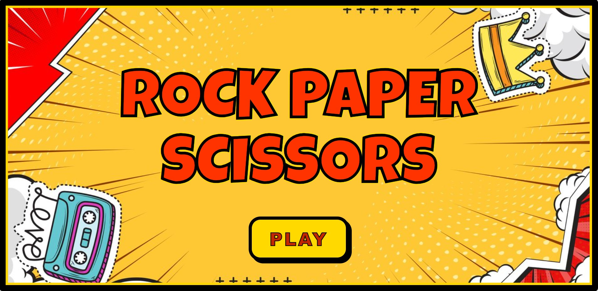
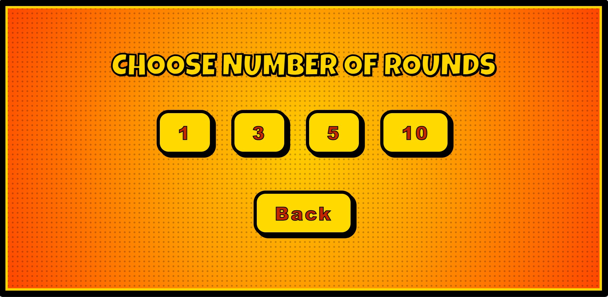
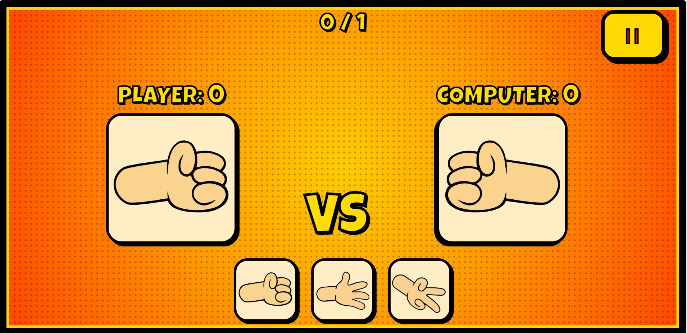
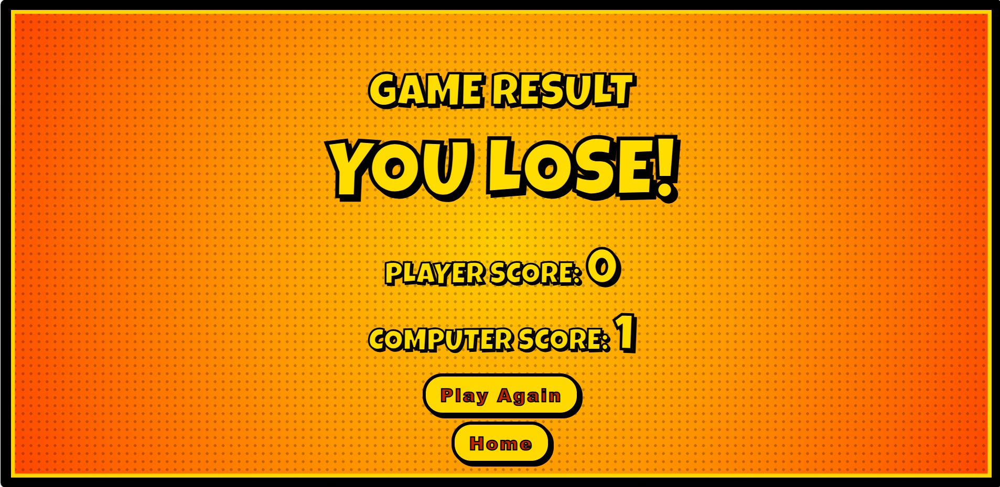

# Rock–Paper–Scissors Arcade Game
**Author:** Javier Caren
**Course:** DC 101 – Web Development
**Project Title:** Mini Arcade – Browser Game
**Mode:** Individual Work

## Game Title
**Comic Rock–Paper–Scissors Game**

A browser-based mini arcade game where the player competes against the computer in a classic Rock–Paper–Scissors match. The game features animated hand graphics, countdown effects, sound effects, scoring, and a final results screen.

## Game Description
This project is a fully interactive Rock–Paper–Scissors browser game designed with a colorful comic-inspired theme. The game allows players to choose the number of rounds before starting, giving flexibility for short or extended matches. Each round begins with a countdown animation followed by lively shake effects on both player and computer hands to simulate anticipation before revealing the choices.

The game features smooth transitions between panels, including the title screen, round selection, gameplay interface, and final results screen. Sound effects enhance the experience—such as button clicks, countdown tones, win/lose sounds, and a short confetti celebration when the player wins the overall match. The scoring system updates every round, and a pause menu lets players resume, restart, or return to the home screen at any time.

With its bright visuals, responsive layout, modular JavaScript logic, and playful animations, the game provides a simple yet engaging arcade-style experience that showcases essential web development concepts.

## 🛠️ Technologies Used
- **HTML** – Structure of the game
- **CSS3** – Styling, layout, animations, and comic effects
- **JavaScript** – Game logic, scoring, countdown, event handling
- **Git & GitHub** – Version control and project hosting

## Instructions to Run the Game
### **Option 1 — Run Locally**
1. Download or clone the project folder
2. Make sure the folder contains:
   - `index.html`
   - `style.css`
   - `script.js`
   - `assets/` (images, sounds, icons)
3. Open **index.html** in any browser (Chrome recommended)

### **Option 2 — GitHub Pages (If you enabled deployment)**
1. Go to **Settings → Pages**
2. Set the branch to **main**
3. Save
4. Visit the GitHub Pages link generated

## Screenshots

### Home Screen

### Rounds Selection

### Gameplay

### Result Screen

## References
- Confetti library: https://www.npmjs.com/package/canvas-confetti
- Royalty-free sound effects